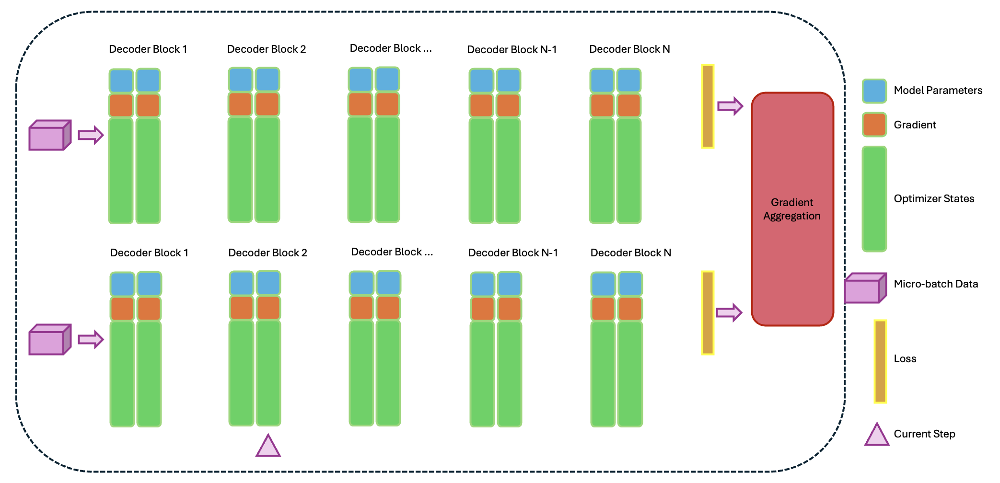
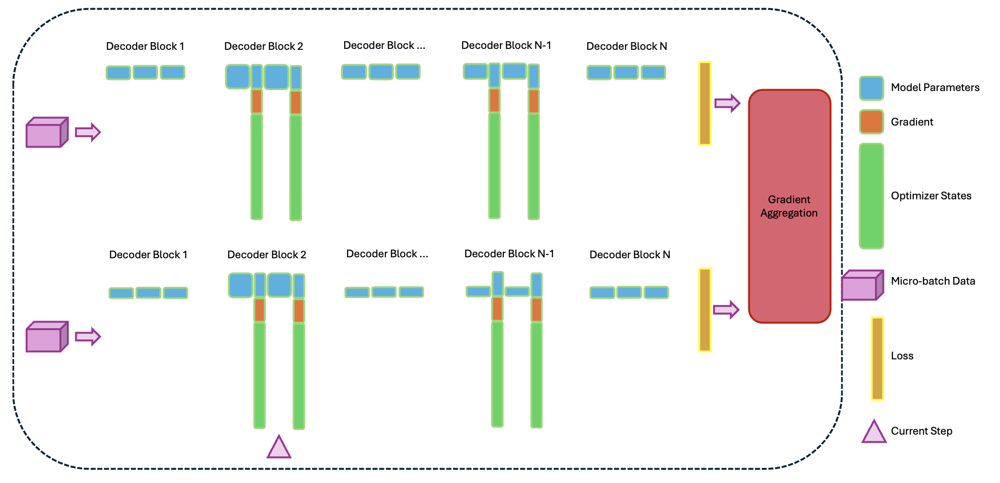
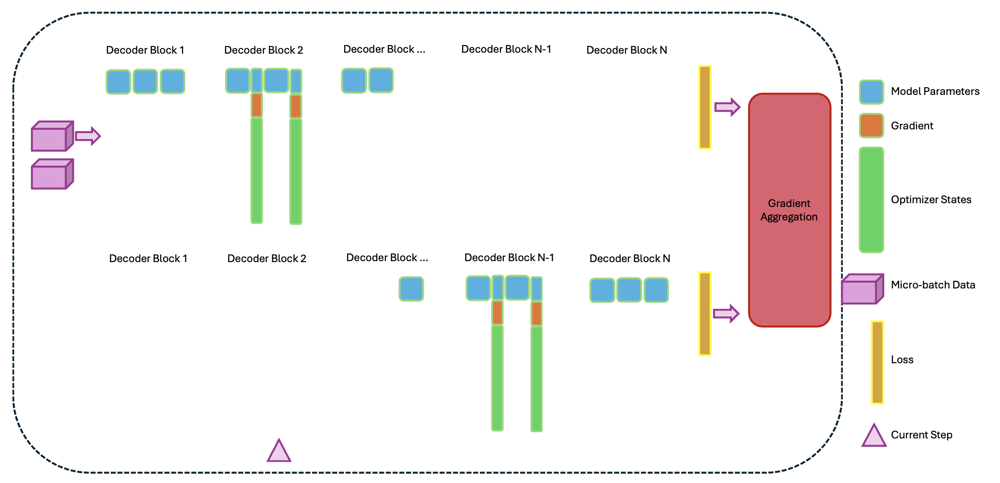

## 1. Summary

The modern hybrid attention architecture large language models (LLM) such as Jet-Nemotron[1] introduce new challenge for multi-GPUs parallel training. Furthermore, such special hybrid attentio architecture can work with specialized low rank adaption (LoRA)[2] for finetuning, which further complex the situation to design an efficient parallel training pipeline. In this project, we aim to profile existing widely used parallelism's performance on parallel training of hybrid attention models with LoRA, with training trhoughput and GPU memory saving as the metrics.

## 2. Background
Modern LLMs are still dominated by Transformer-style architectures [3], whose central multi-head self-attention mechanism enables powerful content-based reasoning but comes with quadratic dependence on sequence length. For a sequence of length L and hidden size d, standard self-attention requires O(L^2 d) time and O(L^2) memory to form all pairwise token interactions, which quickly becomes a bottleneck for long-context training and inference. In practice, this quadratic scaling drives up both compute and KV-cache memory, limiting feasible context lengths on current accelerators and motivating a broad line of research on sub-quadratic or linear-time alternatives.

Recent state-space and linear-attention models such as Mamba[4] and Gated DeltaNet[5] push this direction further by achieving true linear complexity in sequence length while remaining competitive with Transformers. Mamba uses selective state-space dynamics to obtain O(L) time and memory and demonstrates that linear-time models can approach or match Transformer quality on several language benchmarks. Gated DeltaNet builds on this line by combining Mamba-style gating with DeltaNet-style linear attention and supports hybrid designs that interleave linear layers with sparse or sliding-window attention. However, purely linear or SSM-based models still tend to lag full attention on some long-context reasoning and challenging language tasks, prompting interest in hybrid architectures. NVIDIA’s Jet-Nemotron team exemplify this intermediate approach: they retain a small fraction of full-attention layers for global reasoning while replacing most layers with gated deltanet-style linear components[1]. This yields hybrid LLM that match or exceed strong full-attention baselines, while delivering order-of-magnitude gains in generation throughput (up to ~50x) at very long context lengths on modern GPUs.

To train such hybrid model, a classic approach that are widely used is using the standard transformers library with built in distributed data parallel (DDP) and fully sharded data parallel (FSDP), as illustrated in the diagrams in Table 1. Notice for FSDP, since every parameter is sharded, the parameter for each decoder block is all-gathered when the computation arrive to that decoder block.

<table>
  <tr>
    <th></th>
    <th>DDP</th>
    <th>FSDP</th>
  </tr>

  <tr>
    <th align="right">Classic Transformer</th>
    <td align="center">
      
    </td>
    <td align="center">
      
    </td>
  </tr>

  <tr>
    <th align="right">Hybrid Attention LLM</th>
    <td align="center">
      
    </td>
    <td align="center">
      
    </td>
  </tr>

  <tr>
    <th align="right">Hybrid Attention with LoRA</th>
    <td align="center">
      
    </td>
    <td align="center">
      
    </td>
  </tr>
</table>

<b>Table 1. Parallelization Strategies for Classic LLM, Hybrid LLM, and Sparsely Activated Hybrid LLM</b>

## 3. Methodology (The Challenge)
As shown in Table 1, DDP and FSDP generally works fine when we are only doing full finetuning, but both DDP and FSDP does not reach ideal memory saving when the model is sparsely activated. This is becasue DDP still duplicate the entire model in each GPU while the naive FSDP does not support non-uniform activated weight in a flat tensor, which force programmer to make FSDP use original parameters instead of flatten them, but then FSDP would keep the full “original” base weights alongside FSDP’s internal flat/sharded buffers instead of truly sharding them away.

### 3.1 Fully Sharded Data Parallel / ZeRO-3 with Distributed Tensor
An initial solution we will implement is to solve the problem with flat tensor of FSDP by utilize distributed tensor introduced by PyTorch. [DTensor](https://docs.pytorch.org/docs/stable/distributed.tensor.html) is still in alpha state and under development by PyTorch, but it make parameter sharding primitives as a SPMD (single program, multiple data) programming model to user, which allow us to implement the sharding such that both frozen and non-frozen weight are evenly sharded across devices. Furthermore, we make sure that the optimizer only every look at the activated weights, so there is no need to falsely allocate any extra space for frozen parameters, and non-frozen parameters should have gradient and optimizer states sharded evenly by DTensor.

<b>Figure 1. Fully Sharded Data Parallel / ZeRO-3 with Distributed Tensor</b>

### 3.2 Pipeline Parallelism
Another parallel training method is model pipeline parallelism, and it theoretically provide better memory saving and faster throughput because far less all-gather is required. We will also implement it to empirically experiment its performance compare to the previous method.

<b>Figure 2. Pipeline Parallelism</b>

However, the weight sharding stretagy is critical here, because if we are given the model architecture that does not have same repeated architecture, or have non-uniformly activated parameters, as illustrated in Figure 3, the sharding is likely to be uneven if it is simply based on parameters size.

  

<b>Figure 3. An Example of Complex Hybrid Attention LLM</b>

Therefore, we could further test and run different parameter sharding strategy to come up with the optimize sharding stretagy that balance workload across all devices, as shown in Figure 4 and Figure 5.

<table>
  <tr>
    <td align="center">
       
      <b>Figure 4. Pipeline Parallelism   (Uniform Parameters Split)</b>
    </td>
    <td align="center">
       
      <b>Figure 5.  Pipeline Parallelism   (Dynamic Parameters Split)</b>
    </td>
  </tr>
</table>

## 4. Resources

* We will be using computers with x86-64 based CPU and cuda-enabled multi-GPUs.
* We will start our training pipeline code base from scratch, but we will reuse the LLM model architecture are defined in the `transformers` code base from [Hugging Face](https://huggingface.co/).
* The paper we referred are listed in the **References** section below. We learn the parallel deep learning stretagies from [15418 class lectures](https://www.cs.cmu.edu/~418/schedule.html) along with [official documentation of PyTorch](https://docs.pytorch.org/docs/stable/index.html).
* It would be great if we can get access to multi-node GPUs (V100s and H100s) in Pittsburgh Supercomputing Center 

## 5. Goals and Deliverables
1. PLAN TO ACHIEVE:
   * 50% goal: Implementing and Analyze Performance of baseline methods (**DDP** and **naive FSDP**)
   * 75% goal: Implementing and Analyze Performance of **Fully Sharded Data Parallel / ZeRO-3 with Distributed Tensor**
   * 100% goal: Implementing and Analyze Performance of **Pipeline Parallelism with Uniform Parameters Split**
2. HOPE TO ACHIEVE:
   * 125% goal: Implementing and Analyze Performance of **Pipeline Parallelism with Dynamic Parameters Split**
   * 150% goal: Incorporate **Model Tensor Parallelism** as an additional dimension of parallelism, and can also write a LoRA Linear CUDA kernel
3. We hope to learn about the true performance of these parallel training strategies
   1. The training pipeline should display reasonable loss curve to verify correctness.
   2. We can then came up with a solution that balance optimization for GPU memory saving and throughput.
   3. Our deliberable will also show throughput graph and memory saving graph for each of the parallel training strategies.
4. This study will offer guide along with working implementation of finetuning hybrid attention LLM with sparsely activated weight, which can be helpful for a lot of engineers and researchers in the field of AI and Machine Learning Systems.
  
## 6. Platform Choice

We will be using linux OS and python language, including `torch` primitives for tensor operation and device communication from PyTorch and model architecture and weight from `transformers` library from [Hugging Face](https://huggingface.co/). We choose these because they are widely used in modern LLM distributed training projects.

## 7. Schedule
Week 1 (11/16-11/22):
1. Implementing DDP
2. Implementing naive FSDP
3. Fully Sharded Data Parallel / ZeRO-3 with Distributed Tensor

Week 2 (11/23-11/29):
1. Testing throughput for the methods implemented in week 1
2. Testing memory saving for the methods implemented in week 1

Week 3 (11/30-12/6):
1. Implementing **Pipeline Parallelism with Uniform Parameters Split**
2. Maybe implementing **Pipeline Parallelism with Dynamic Parameters Split**

Week 2 (12/7-12/13):
1. Testing throughput for pipeline parallelism methods
2. Testing memory saving for pipeline parallelism methods

## 8. References
[1] Gu, Y., Hu, Q., Yang, S., Xi, H., Chen, J., Han, S., & Cai, H. (2025). Jet-Nemotron: Efficient Language Model with Post Neural Architecture Search. arXiv preprint arXiv:2508.15884.

[2] Hu, E. J., Shen, Y., Wallis, P., Allen-Zhu, Z., Li, Y., Wang, S., ... & Chen, W. (2022). Lora: Low-rank adaptation of large language models. ICLR, 1(2), 3.

[3] Vaswani, A., Shazeer, N., Parmar, N., Uszkoreit, J., Jones, L., Gomez, A. N., ... & Polosukhin, I. (2017). Attention is all you need. Advances in neural information processing systems, 30.

[4] Gu, A., & Dao, T. (2024, May). Mamba: Linear-time sequence modeling with selective state spaces. In First conference on language modeling.

[5] Yang, S., Kautz, J., & Hatamizadeh, A. (2024). Gated delta networks: Improving mamba2 with delta rule. arXiv preprint arXiv:2412.06464.

This sentence uses `$` delimiters to show math inline: $\sqrt{3x-1}+(1+x)^2$
